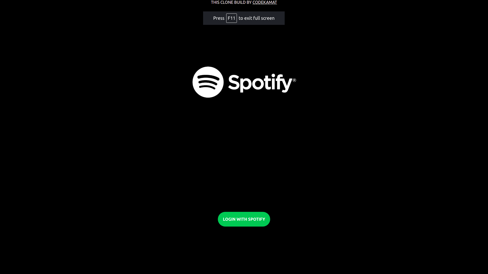
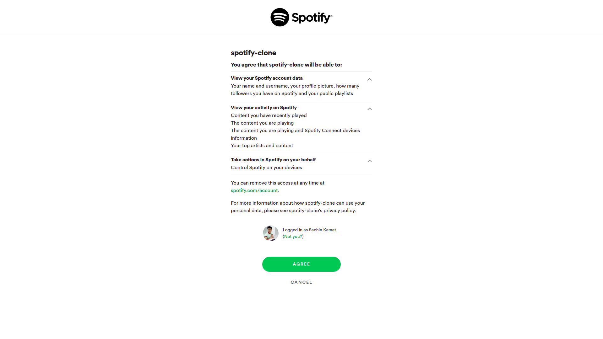
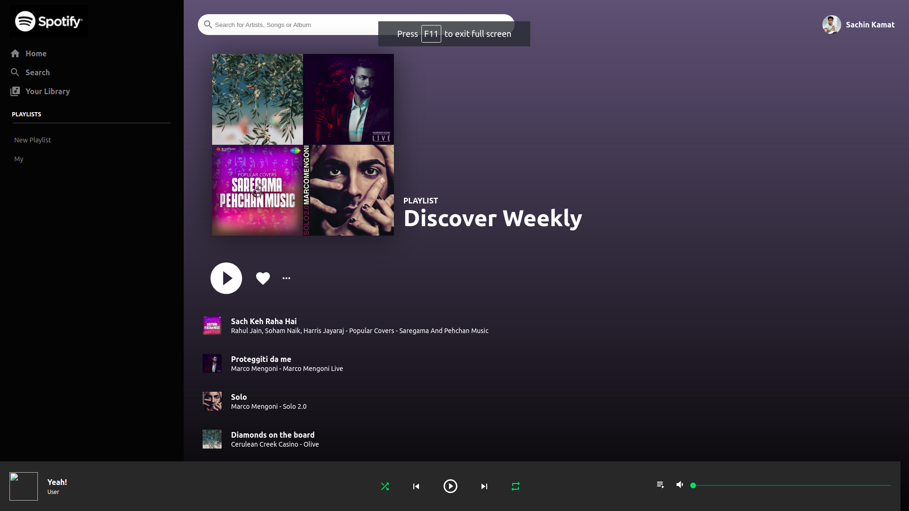

# Spotify Clone by codekamat

#### See Live Site: <https://codekamatspotify.netlify.app/>

#### Description:

Build a Spotify Clone with REACT JS

#### How to develop it

- Clone on your local machine by using `git@github.com:codeKAMAT/spotify-clone-by-codekamat.git`
- Navigate into the main directory
- Run `npm install` to install node modules
- Run `npm start` to run it locally then will open automatclly on your browser on `localhost:3000` port
- Run `npm run build` to create a production build

#### Tech Stack-

- React
- Material UI Icons
- CSS

#### Screens :computer:

